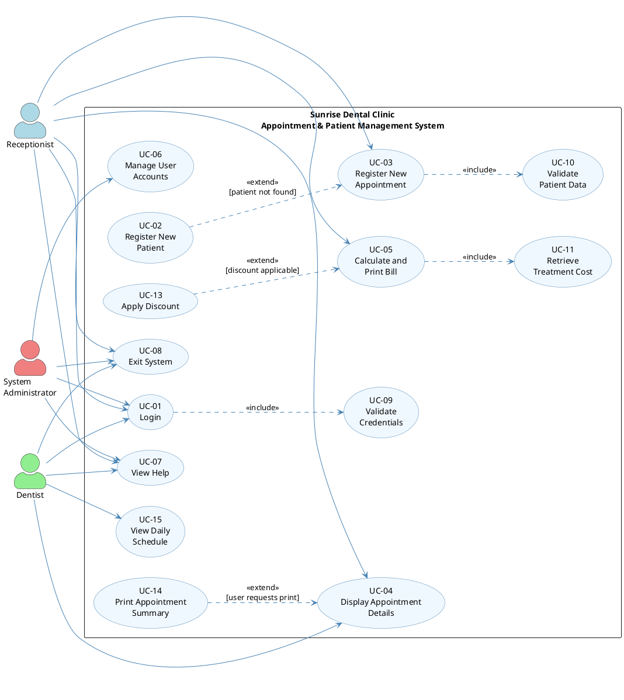
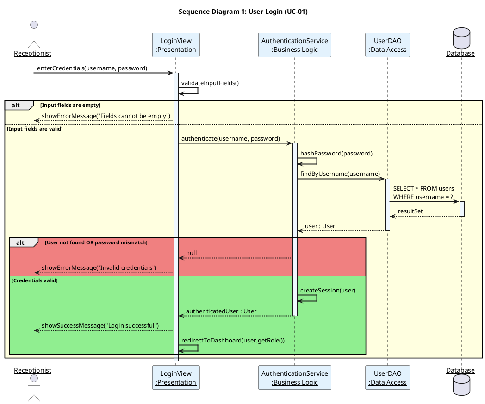
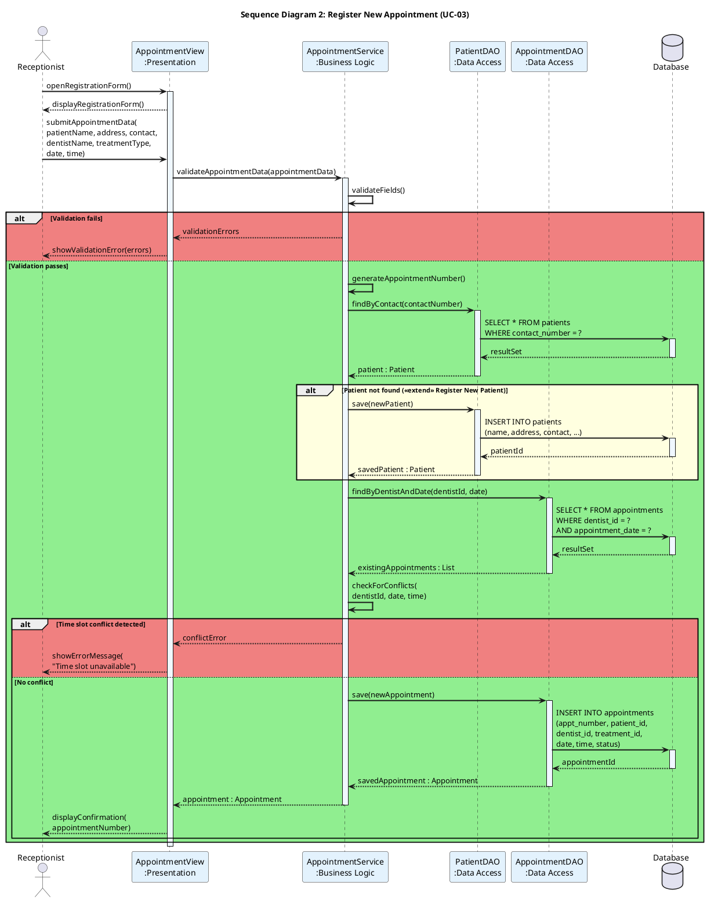
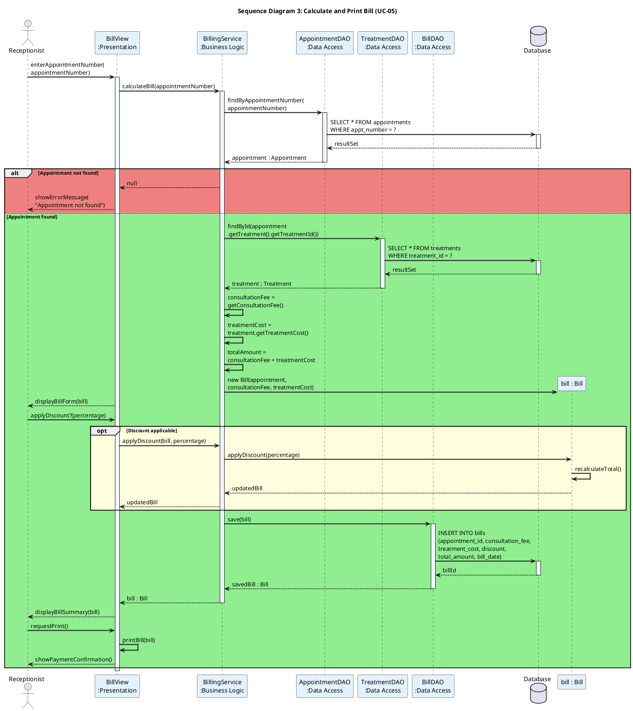

# Phase 1: System Design — Sunrise Dental Clinic
## Appointment & Patient Management System

---

## 1. Use Case Diagram

### Actor Identification

| Actor | Role | Justification |
|-------|------|---------------|
| **Receptionist** | Primary user who registers patients, books appointments, generates bills | Front-desk staff handling day-to-day clinic operations |
| **System Administrator** | Manages user accounts, system configuration, and access control | IT/management staff responsible for system maintenance |
| **Dentist** | Views assigned appointments and patient treatment history | Clinical staff who needs read-access to schedules and records |

### Use Case Summary

| # | Use Case | Primary Actor(s) | Description |
|---|----------|-------------------|-------------|
| UC-01 | Login | All Actors | Authenticate user credentials for system access |
| UC-02 | Register New Patient | Receptionist | Capture new patient demographic details |
| UC-03 | Register New Appointment | Receptionist | Schedule a new appointment with all required details |
| UC-04 | Display Appointment Details | Receptionist, Dentist | Search and view appointment information by appointment number |
| UC-05 | Calculate and Print Bill | Receptionist | Compute treatment cost + consultation fee and generate receipt |
| UC-06 | Manage User Accounts | System Administrator | Create, update, or deactivate staff user accounts |
| UC-07 | View Help | All Actors | Access step-by-step system usage instructions |
| UC-08 | Exit System | All Actors | Safely log out and close the application |
| UC-09 | Validate Credentials | System (internal) | Verify username/password against stored records |
| UC-10 | Validate Patient Data | System (internal) | Check completeness and format of patient input fields |
| UC-11 | Retrieve Treatment Cost | System (internal) | Fetch cost for a given treatment type from the database |
| UC-12 | Register New Patient (extend) | Receptionist | Triggered if patient is not already in the system during appointment booking |
| UC-13 | Apply Discount | Receptionist | Optionally apply a discount during billing |
| UC-14 | Print Appointment Summary | Receptionist, Dentist | Optionally print a summary after viewing appointment details |
| UC-15 | View Daily Schedule | Dentist | View all appointments assigned for a specific date |

### Stereotype Usage

- **`<<include>>`** — Models mandatory sub-behaviour that is always invoked:
  - *Login* always includes *Validate Credentials*.
  - *Register New Appointment* always includes *Validate Patient Data*.
  - *Calculate and Print Bill* always includes *Retrieve Treatment Cost*.

- **`<<extend>>`** — Models optional/conditional behaviour:
  - *Register New Patient* extends *Register New Appointment* (only when the patient does not already exist).
  - *Apply Discount* extends *Calculate and Print Bill* (only when a discount is applicable).
  - *Print Appointment Summary* extends *Display Appointment Details* (optional action after viewing).

### PlantUML Code — Use Case Diagram

---

## 2. Class Diagram

### Class Identification by Tier

| Tier | Classes | Purpose |
|------|---------|---------|
| **Presentation** | `LoginView`, `AppointmentView`, `BillView`, `HelpView` | UI/Web layer handling user interaction |
| **Business Logic** | `User`, `Receptionist`, `Admin`, `Dentist`, `Patient`, `Appointment`, `Treatment`, `Bill`, `AuthenticationService`, `AppointmentService`, `BillingService` | Core domain model and service layer |
| **Data Access** | `UserDAO`, `PatientDAO`, `AppointmentDAO`, `TreatmentDAO`, `BillDAO`, `DatabaseConnection` | Persistence and database operations (DAO Pattern) |

### PlantUML Code — Class Diagram

```plantuml
@startuml ClassDiagram
skinparam classAttributeIconSize 0
skinparam class {
    BackgroundColor #FAFAFA
    BorderColor #333333
    ArrowColor #333333
}
skinparam package {
    BackgroundColor #F5F5F5
    BorderColor #999999
}

' ═══════════════════════════════════════════════════
'  PRESENTATION TIER
' ═══════════════════════════════════════════════════
package "Presentation Tier" #E8F5E9 {

    class LoginView {
        - usernameField : String
        - passwordField : String
        + displayLoginForm() : void
        + submitCredentials(username : String, password : String) : void
        + showErrorMessage(message : String) : void
        + showSuccessMessage(message : String) : void
    }

    class AppointmentView {
        - appointmentForm : Map<String, String>
        - searchField : String
        + displayRegistrationForm() : void
        + displaySearchForm() : void
        + displayAppointmentDetails(appointment : Appointment) : void
        + displayDailySchedule(appointments : List<Appointment>) : void
        + submitAppointmentData(data : Map<String, String>) : void
        + showValidationError(field : String, message : String) : void
    }

    class BillView {
        - billDetails : Bill
        + displayBillForm(appointment : Appointment) : void
        + displayBillSummary(bill : Bill) : void
        + printBill(bill : Bill) : void
        + showPaymentConfirmation() : void
    }

    class HelpView {
        - helpContent : String
        + displayHelpMenu() : void
        + displayHelpTopic(topic : String) : void
    }
}

' ═══════════════════════════════════════════════════
'  BUSINESS LOGIC TIER
' ═══════════════════════════════════════════════════
package "Business Logic Tier" #E3F2FD {

    ' ── User Hierarchy (Inheritance) ──
    abstract class User {
        - userId : int
        - username : String
        - password : String
        - fullName : String
        - email : String
        - role : String
        - isActive : boolean
        + login(username : String, password : String) : boolean
        + logout() : void
        + getUserId() : int
        + getUsername() : String
        + getRole() : String
        + setPassword(password : String) : void
        + isActive() : boolean
    }

    class Receptionist {
        - staffId : String
        - contactNumber : String
        + registerAppointment(appointment : Appointment) : boolean
        + searchAppointment(appointmentNumber : String) : Appointment
        + generateBill(appointment : Appointment) : Bill
        + getStaffId() : String
    }

    class Admin {
        - adminLevel : int
        + createUser(user : User) : boolean
        + updateUser(userId : int, user : User) : boolean
        + deactivateUser(userId : int) : boolean
        + viewAllUsers() : List<User>
        + getAdminLevel() : int
    }

    class Dentist {
        - dentistId : String
        - specialization : String
        - licenseNumber : String
        + viewAppointments(date : Date) : List<Appointment>
        + getDentistId() : String
        + getSpecialization() : String
        + getLicenseNumber() : String
    }

    ' ── Core Domain Classes ──
    class Patient {
        - patientId : int
        - patientName : String
        - address : String
        - contactNumber : String
        - email : String
        - dateOfBirth : Date
        - registrationDate : Date
        + getPatientId() : int
        + getPatientName() : String
        + getAddress() : String
        + getContactNumber() : String
        + setAddress(address : String) : void
        + setContactNumber(contactNumber : String) : void
    }

    class Appointment {
        - appointmentNumber : String
        - appointmentDate : Date
        - appointmentTime : Time
        - status : String
        - notes : String
        - createdDate : Date
        + getAppointmentNumber() : String
        + getAppointmentDate() : Date
        + getAppointmentTime() : Time
        + getStatus() : String
        + setStatus(status : String) : void
        + getPatient() : Patient
        + getDentist() : Dentist
        + getTreatment() : Treatment
    }

    class Treatment {
        - treatmentId : int
        - treatmentType : String
        - treatmentDescription : String
        - treatmentCost : double
        - duration : int
        + getTreatmentId() : int
        + getTreatmentType() : String
        + getTreatmentCost() : double
        + getDuration() : int
        + setTreatmentCost(cost : double) : void
    }

    class Bill {
        - billId : int
        - consultationFee : double
        - treatmentCost : double
        - discountPercentage : double
        - totalAmount : double
        - billDate : Date
        - paymentStatus : String
        + calculateTotal() : double
        + applyDiscount(percentage : double) : void
        + generateBillReceipt() : String
        + printBill() : void
        + getBillId() : int
        + getTotalAmount() : double
        + getPaymentStatus() : String
    }

    ' ── Service Classes (Facade / Business Logic) ──
    class AuthenticationService {
        - userDAO : UserDAO
        - maxLoginAttempts : int
        + authenticate(username : String, password : String) : User
        + validateSession(sessionId : String) : boolean
        + hashPassword(password : String) : String
        + logout(userId : int) : void
    }

    class AppointmentService {
        - appointmentDAO : AppointmentDAO
        - patientDAO : PatientDAO
        + registerAppointment(appointment : Appointment) : boolean
        + searchByAppointmentNumber(appointmentNumber : String) : Appointment
        + getAppointmentsByDentist(dentistId : String, date : Date) : List<Appointment>
        + validateAppointmentData(appointment : Appointment) : boolean
        + checkForConflicts(dentistId : String, date : Date, time : Time) : boolean
        + generateAppointmentNumber() : String
    }

    class BillingService {
        - billDAO : BillDAO
        - treatmentDAO : TreatmentDAO
        + calculateBill(appointment : Appointment) : Bill
        + retrieveTreatmentCost(treatmentId : int) : double
        + applyDiscount(bill : Bill, percentage : double) : Bill
        + saveBill(bill : Bill) : boolean
        + getConsultationFee() : double
    }
}

' ═══════════════════════════════════════════════════
'  DATA ACCESS TIER
' ═══════════════════════════════════════════════════
package "Data Access Tier" #FFF3E0 {

    class DatabaseConnection <<Singleton>> {
        - {static} instance : DatabaseConnection
        - connection : Connection
        - url : String
        - username : String
        - password : String
        - DatabaseConnection()
        + {static} getInstance() : DatabaseConnection
        + getConnection() : Connection
        + closeConnection() : void
    }

    class UserDAO {
        - dbConnection : DatabaseConnection
        + findByUsername(username : String) : User
        + findById(userId : int) : User
        + save(user : User) : boolean
        + update(user : User) : boolean
        + delete(userId : int) : boolean
        + findAll() : List<User>
    }

    class PatientDAO {
        - dbConnection : DatabaseConnection
        + findById(patientId : int) : Patient
        + findByName(name : String) : List<Patient>
        + findByContact(contactNumber : String) : Patient
        + save(patient : Patient) : boolean
        + update(patient : Patient) : boolean
        + findAll() : List<Patient>
    }

    class AppointmentDAO {
        - dbConnection : DatabaseConnection
        + findByAppointmentNumber(appointmentNumber : String) : Appointment
        + findByDentistAndDate(dentistId : String, date : Date) : List<Appointment>
        + findByPatient(patientId : int) : List<Appointment>
        + save(appointment : Appointment) : boolean
        + update(appointment : Appointment) : boolean
        + findAll() : List<Appointment>
    }

    class TreatmentDAO {
        - dbConnection : DatabaseConnection
        + findById(treatmentId : int) : Treatment
        + findByType(treatmentType : String) : Treatment
        + findAll() : List<Treatment>
        + save(treatment : Treatment) : boolean
    }

    class BillDAO {
        - dbConnection : DatabaseConnection
        + findById(billId : int) : Bill
        + findByAppointment(appointmentNumber : String) : Bill
        + save(bill : Bill) : boolean
        + update(bill : Bill) : boolean
        + findAll() : List<Bill>
    }
}

' ═══════════════════════════════════════════════════
'  RELATIONSHIPS
' ═══════════════════════════════════════════════════

' ── Inheritance ──
User <|-- Receptionist
User <|-- Admin
User <|-- Dentist

' ── Composition (strong lifecycle dependency) ──
Appointment *-- "1" Patient       : has >
Appointment *-- "1" Treatment     : includes >
Bill *-- "1" Appointment          : generated for >

' ── Aggregation (weak association) ──
Appointment o-- "1" Dentist       : assigned to >

' ── Association with multiplicity ──
Patient "1" -- "0..*" Appointment  : books >
Dentist "1" -- "0..*" Appointment  : handles >
Appointment "1" -- "0..1" Bill     : produces >
Treatment "1" -- "0..*" Appointment : used in >

' ── Service Dependencies (uses) ──
LoginView ..> AuthenticationService     : uses >
AppointmentView ..> AppointmentService  : uses >
BillView ..> BillingService             : uses >

AuthenticationService ..> UserDAO       : uses >
AppointmentService ..> AppointmentDAO   : uses >
AppointmentService ..> PatientDAO       : uses >
BillingService ..> BillDAO              : uses >
BillingService ..> TreatmentDAO         : uses >

' ── DAO to Database ──
UserDAO ..> DatabaseConnection          : uses >
PatientDAO ..> DatabaseConnection       : uses >
AppointmentDAO ..> DatabaseConnection   : uses >
TreatmentDAO ..> DatabaseConnection     : uses >
BillDAO ..> DatabaseConnection          : uses >

@enduml
```

---

## 3. Sequence Diagrams

### 3.1 Sequence Diagram 1 — User Login (UC-01)

### 3.2 Sequence Diagram 2 — Register New Appointment (UC-03)

### 3.3 Sequence Diagram 3 — Calculate and Print Bill (UC-05)

---

## 4. Design Decisions, Assumptions & Justification

### 4.1 Design Decisions Justification (~400 words)

The Sunrise Dental Clinic system has been designed following a **3-tier architecture** (Presentation, Business Logic, Data Access) to enforce a clear **Separation of Concerns (SoC)**, where each layer has a well-defined responsibility. This architectural decision directly addresses the assessment requirement for a distributed application and ensures the system is maintainable, testable, and scalable.

The **Presentation Tier** comprises view classes (`LoginView`, `AppointmentView`, `BillView`, `HelpView`) that are responsible solely for rendering the user interface and capturing user input. These classes delegate all business logic processing to the service layer, ensuring that the UI can be modified or replaced (e.g., migrating from JSP to a modern frontend framework) without affecting business rules. This tier will be implemented as web-based interfaces deployed as part of a web application.

The **Business Logic Tier** contains two categories of classes: **domain entities** (`User`, `Patient`, `Appointment`, `Treatment`, `Bill`) that encapsulate the clinic's core data model, and **service classes** (`AuthenticationService`, `AppointmentService`, `BillingService`) that implement the application's business rules. The service classes act as a **Facade Pattern**, providing a simplified interface to the complex subsystem of DAOs and domain objects. This ensures business rules such as appointment conflict checking, bill calculation, and credential validation are centralized and reusable.

The **Data Access Tier** employs the **Data Access Object (DAO) Pattern** to abstract all database interactions behind a clean interface. Each entity has a corresponding DAO (`UserDAO`, `PatientDAO`, `AppointmentDAO`, `TreatmentDAO`, `BillDAO`), which allows the database technology to be changed without impacting the business logic. The `DatabaseConnection` class implements the **Singleton Pattern** to ensure only one database connection pool is managed throughout the application's lifecycle, preventing resource leaks and connection exhaustion.

The **User class hierarchy** uses inheritance — an abstract `User` class with concrete subclasses `Receptionist`, `Admin`, and `Dentist` — to enforce polymorphism and role-based access control. This aligns with the **Open/Closed Principle**, making it easy to add new roles in the future without modifying existing code.

In the class diagram, **composition** is used between `Appointment` and `Patient`/`Treatment` because an appointment cannot meaningfully exist without these entities, while **aggregation** is used for the `Dentist`–`Appointment` relationship because a dentist exists independently of any appointment. **Multiplicity** annotations (e.g., `1` to `0..*`) formally document cardinality constraints directly derived from the business rules.

The **sequence diagrams** trace the message flow across all three tiers, demonstrating how a user action at the presentation layer propagates through the service layer to the data access layer and database, validating that the proposed architecture supports the identified use cases end-to-end.

### 4.2 Documented Assumptions

| # | Assumption | Rationale |
|---|-----------|-----------|
| A1 | Each appointment is assigned a **unique, system-generated appointment number** (e.g., `APT-20240101-001`). | Eliminates human error in numbering and ensures uniqueness. |
| A2 | The clinic operates with a **predefined list of treatment types** with fixed costs stored in the database. | Standardises billing and simplifies the cost retrieval process. |
| A3 | A **fixed consultation fee** is applied to every appointment, separate from treatment costs. | Reflects real-world clinic billing practices. |
| A4 | Only the **Receptionist** role can register appointments and generate bills; Dentists have **read-only** access to schedules. | Enforces role-based access control as per the scenario. |
| A5 | The **System Administrator** manages user accounts but does not interact with clinical or appointment data. | Maintains separation of administrative and operational duties. |
| A6 | **Patient contact number** is used as a unique identifier when checking for existing patients during appointment registration. | Practical unique identifier before formal patient ID is assigned. |
| A7 | The system **checks for scheduling conflicts** — a dentist cannot have two appointments at the same date and time. | Directly addresses the "double booking" problem stated in the scenario. |
| A8 | **Discount application** during billing is an optional feature available at the receptionist's discretion. | Adds business flexibility without overcomplicating the core billing flow. |
| A9 | The system uses a **relational database** (e.g., MySQL) for persistent storage. | Standard choice for structured clinical data with referential integrity. |
| A10 | **Password hashing** is implemented before storing credentials in the database. | Essential security practice for protecting user data. |

### 4.3 How the Diagrams Support the 3-Tier Architecture

| Diagram | Contribution to Architecture |
|---------|------------------------------|
| **Use Case Diagram** | Defines the functional requirements from the user's perspective. Each use case maps to an operation that spans all three tiers — user interaction (Presentation), processing logic (Business Logic), and data persistence (Data Access). The `<<include>>` and `<<extend>>` stereotypes identify mandatory and optional sub-flows within these operations. |
| **Class Diagram** | Explicitly organises classes into three colour-coded packages mirroring the 3-tier architecture. It shows that Presentation classes depend only on Service classes, Service classes depend only on DAO classes, and DAO classes depend only on the `DatabaseConnection`, ensuring unidirectional dependency flow. |
| **Sequence Diagrams** | Validate the architecture by tracing message flows from the actor through the Presentation layer, into the Business Logic layer, down to the Data Access layer and database, and back. Each diagram proves that the proposed class structure can fulfil the corresponding use case within the defined architectural boundaries. |

---

*End of Phase 1: System Design*
